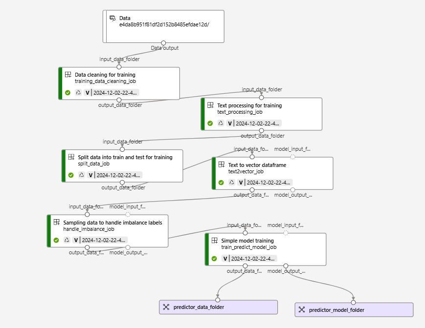
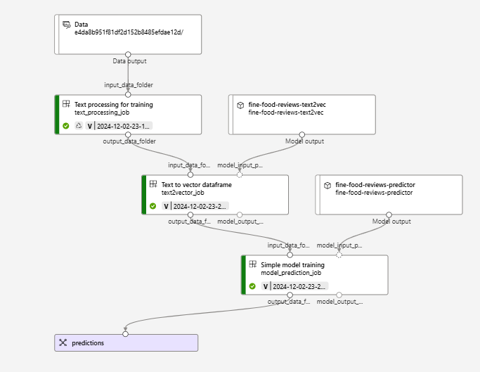

# Fine Food Reviews Classification

## Problem Statement

In today’s competitive market, understanding customer sentiment is crucial for improving product offerings and enhancing customer satisfaction. This project focuses on **extracting actionable insights from customer reviews** of fine food products on Amazon using **data analytics** and **machine learning techniques**. By analyzing these reviews, businesses can gain a deeper **understanding of customer preferences, behavior, and overall satisfaction**.

The project leverages a **machine learning model** with an **automated training and inference pipeline**, allowing businesses to process large volumes of text data efficiently. The inference pipeline is **deployed to predict sentiment** from customer reviews **in batch**, with the flexibility to **extend to other text sources** such as tweets, emails, and more. This solution empowers businesses to make informed decisions and deliver personalized customer experiences, driving growth and customer loyalty.

**Business Purpose and Objectives:**
1. Comprehensive Review Analysis:
- Analyze customer reviews to uncover meaningful patterns and trends.
- Gain insights into overall customer sentiment toward products and identify key factors influencing satisfaction.

1. Sentiment Prediction Model:
- Develop a predictive model to estimate customer ratings based on their written reviews.
- Leverage sentiment analysis to ensure alignment between textual reviews and ratings, while detecting anomalies such as "troll" reviews or inconsistent feedback.
- Implement a generic text model to extend sentiment analysis capabilities beyond reviews, enabling analysis of various text formats such as tweets, emails, and social media posts.

1. Actionable Insights for Business Impact:
- Enhance trend analysis to improve business metrics and performance.
- Support data-driven decision-making in areas such as customer satisfaction, product development, and feedback evaluation.

**Data used:** https://www.kaggle.com/datasets/snap/amazon-fine-food-reviews/download?datasetVersionNumber=2
Note: it will require you to log in Kaggle.

## Technologies

- **Jupyter Notebooks:** EDA and experimentation
- **Python:** job scripts for production and deployment
- **Azure Machine Learning:** ML framework, MLOps, Model Registry, Training Pipeline and Inference Endpoint
- **Azure**: Key Vault, Blob Storage
- **Docker:** containers
- **MLFlow:** Model Tracking

## Technical Overview

### 1. Advanced Analytics:

This section documents the key notebooks used for advanced analytics, detailing the techniques and processes applied in each notebook.

The entire process was initially developed using a smaller dataset and is documented across the following notebooks:

- **Data Cleaning and Validation:** Identified and resolved inconsistencies such as duplicate customer reviews and illogical data errors to locate potential trolls or bots. [Notebook](reports/1_training_data_cleaning.ipynb)
- **Data Exploration:** Conducted trend analysis to explore relationships between products, users, and reviews, uncovering valuable insights about customer behavior. [Notebook](reports/2_data_exploration.ipynb)
- **Data Preprocessing:** Focuses on transforming and cleaning the data to ensure it is properly prepared for model input [Notebook](reports/3_data_preprocessing.ipynb)
- **Word2Vec Training:** Provides a comprehensive guide to training the Word2Vec model. [Notebook](reports/4_Word2Vec_training.ipynb)
- **Comparing Different preprocess models:** Compares and explains the selected models for converting text to vectors and handling imbalanced datasets. [Notebook](reports/5_comparing_pretraining_models.ipynb)
- **Model Training:** Tested the capacity of the models and if the task can be performed with them good enough. [Notebook](reports/5_comparing_pretraining_models.ipynb)
- **Sentiment Analysis:** Tested the NLTK sentiment analysis model as a complement to a proprietary model, focusing on identifying and analyzing prediction mismatches. [Notebook](reports/SentimentAnalysis.ipynb)

### 2. Components from Azure ML

Both pipelines utilize multiple shared components to achieve an end-to-end workflow. These components are modular, allowing for parameterization of dataset-specific features such as the text and target column names. This design ensures transparency and adaptability across datasets. The model components are organized into two primary classes: one for training and another for inference, orchestrated via a main pipeline class.

**Azure ML Integration:**
Each pipeline step includes:
- A script for the Azure ML component. `<step_name>_component.py`
- Supporting script for creating and running the components in Azure ML. `manage_<step_name>_component.py`

The details of each component:

1. **Training Data Cleaning:** Automatically removes duplicates, irrelevant columns, and transforms ratings from a 1–5 scale to binary (0–1) [Step Script](src/pipeline_steps/training_data_cleaning/training_data_cleaning_step.py)
2. **Text processing:** Applies traditional NLP techniques:
     1. Sentence level cleaning: Handles abbreviations, repeated letters, several patterns,... [Script](src/pipeline_steps/text_processing/sentence_cleaning_classes.py)
     2. Token-level processing: Includes lemmatization and stopword removal. [Script](src/pipeline_steps/text_processing/text_processing_functions.py)
     
     Modular design allows seamless addition of custom steps. [Step Script](src/pipeline_steps/text_processing/text_processing_step.py)
3. **Data Splitting:** Splits processed data into training and testing datasets after general cleaning steps. [Step Script](src/pipeline_steps/split_data/split_data_step.py)
4. **Text to vector:** Converts processed text into vector representations using models like CountVectorizer, TfidfVectorizer, or Word2Vec. Additionally, uses cross-validation with a configurable dummy model to select the optimal representation method. [Step Script](src/pipeline_steps/split_data/split_data_step.py)
5. **Handling Imbalance Dataset:** Tackles class imbalance by testing various resampling techniques using cross-validation, selecting the best method, and saving the resampled dataset. [Step Script](src/pipeline_steps/handle_imbalance/handle_imbalance_step.py)
6. **Model Training/Prediction:** The training process evaluates DecisionTree, SVC, and LogisticRegression models through cross-validation, identifying and saving the best-performing model.

### 3. Training Pipeline:

The training pipeline can be run both [locally](./local_training_pipeline.py) and in [Azure ML](./create_azure_training_pipeline.py).

It contains the five core components outlined above and the local pipeline includes two additional steps:
- Data Loading: At the beginning of the pipeline for seamless integration.
- Model Registration: Saves trained models to Azure ML for deployment and inference.

**Azure Training Pipeline:**



### 4. Inference Pipeline:

**Pipeline Steps:**

- Text Processing: Applies the same cleaning and tokenization steps as in training.
- Text-to-Vector Conversion: Transforms input text into vectors using the registered vectorizer.
- Model Prediction: Generates predictions using the trained model

**Azure ML Execution:**
Run this pipeline on [this script](./create_azure_inference_pipeline.py). After execution, publish the pipeline.

**Azure Training Pipeline:**



## How to use

### Steps

After having downloaded the data and put in the data folder (recommended to first create a smaller sample of the dataset for initial testing and experimentation):

1. Create an Azure ML Workspace
2. Fill the `.env` with the `.env_example` variables
3. Run with the Azure CLI to login:
   ```bash
   azd auth login --scope https://management.azure.com/.default
   ```
4. Run [`src/azure_ml_first_setup.py`](src/azure_ml_first_setup.py) to create the compute instances, the Data Asset, the environment and all the pipelines components.
5. Execute [`create_azure_training_pipeline.py`](./create_azure_training_pipeline.py) to create and run the training pipeline.
6. Configure the trained model locations using the `.env` file. Set the paths for:
   - **TEXT2VEC_TRAINED_MODEL_PATH**: Datastore URI after `/path/` to the text-to-vector pickle.
   - **PREDICTOR_TRAINED_MODEL_PATH**: Datastore URI after `/path/` to the trained predictor pickle.
7. Run [`create_azure_inference_pipeline.py`](./create_azure_inference_pipeline.py) to create and run the inference pipeline.
8. Deploy the inference pipeline by running [`create_batch_deployment_for_inference_pipeline.py`](./src/create_batch_deployment_for_inference_pipeline.py). This makes the pipeline available for deployment and use.
9. Ensure you have the necessary permissions before running a job in the new deployment. For example, you can use the role `AzureML Data Scientist` to gain access.
10. Specify the input for the job either in the `.env` file or directly within the script. Once the input is set, run the batch job using [`run_batch_job.py`](./src/run_batch_job.py).
11. In the Azure Portal, configure the `Schedule` for the inference or training pipeline job to automate the MLOps retraining process. To complete the MLOps cycle, you can update the dataset with a new version and schedule a data pipeline to replace the current data before triggering the retraining job.

## Project structure

### Overview of functionality

- `data/`: stores the data locally
- `models/`: stores the trained models locally
- `mlruns/`: contains the mlflow data when running the training pipeline locally
- `reports/`:  Includes all notebook experiments related to the training pipeline.
- `src/`: Contains all code required to deploy and manage pipelines.

### Details of the src directory
- **Root level**: contains the key scripts executed directly for each step. These scripts handle common setup tasks: loading environment variables from .env, adding the working directory to the Python path and initializing the logger.
- `pipeline_components/`: this directory organizes pipeline components into individual folders. Each folder contains three core files:
  - `\<component_name>_step.py`: implements the core logic of the component. It is shared between the local and Azure ML pipelines.
  - `\<component_name>_component.py`: Wraps the component logic into a main() function, defines inputs and outputs for integration with the Azure ML pipeline and prepares outputs as needed for downstream tasks.
  - `manage_\<component_name>_component.py`: handles the creation and optional standalone execution of the component. The functions `create_azure_component` and `generic_creation_component_inputs_outputs`, located in [azure_ml_utils](./src/tools/azure_ml_utils.py), serve as templates or can be used directly to streamline component creation.
- `local_components/`: Contains additional components required for local workflows or extra functionality not needed in the Azure ML pipeline.

## Future Steps

- Explore additional sentiment analysis models to improve detection of mismatches in subjective reviews.
- Implement parallel processing to reduce training times when working with the full dataset.
- Integrate AutoML component into the Azure training pipeline to optimize model performance.
- Add a scoring and evaluation component to assess model accuracy and performance metrics.
- Establish CI/CD pipelines using GitHub Actions for streamlined deployment and testing workflows.